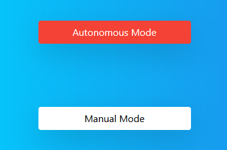

# Autonomous Driving Vehicle
## with Raspberry Pi

(Code removed temporarily)

---


## What it Does

The Raspberry Pi is used to sense the environment and control the vehicle. This project
includes the development of software for the raspberry pi that is used to control the vehicle as well as a Laptop which acts as a nearby server.
The software includes a driverless car control algorithm that is used to navigate the vehicle.
The software is implemented in Python.

--- 

## How it Works

At the center of the project is the Python Flask Application (Flask Server Webview). 

The
Python Flask application first starts the Flask Server. The user is presented with the user interface of the program. This is the first visible element of the system.

First, the Server is started. In our case we are using Acer Aspire 5 Model A515-51-G laptop equipped with Intel Core
i5-8250U 8th gen. processor. 

When the server is started, the Socket connection starts listening
for the Client on localhost port.

Then, the Client, which in our case is Raspberry Pi 3B+, needs to run the Client script. Which
connects the Client to the Server. 

As soon as the Client is Connected to the Server, the Flask
application initializes and presents user with the Web Interface.


Here's the flow chart of the driving logic:

<!-- 
<center>
 </center>


Block Diagram:
<center>
 </center>
--->
## Deep Learning Approach
In this project, I will be using a deep learning algorithm to automatically learn representations
from incoming live video. The model that will be used is trained on a dataset of images, and
will then be able to recognize persons in new images.

The primary uses of Deep Learning regarding Autonomous Driving Vehicle are as follows:
1. Object detection: Object detection is used to identify objects in the environment, such as
other vehicles, pedestrians, and obstacles.
2. Lane detection: Lane detection is used to identify the boundaries of lanes and to track the
position of the vehicle within the lane.
3. Traffic sign recognition: Traffic sign recognition is used to identify and interpret traffic
signs, such as stop signs and yield signs.


## Requirements


### Hardware

* 6th to 12th generation Intel® Core™ processor with Iris® Pro graphics or Intel® HD Graphics.
* Raspberry Pi 3 or newer model.

* DC Geared BO Motors x 4
* TB6612FNG Dual DC Motor Driver
* SR04 Ultrasonic Distance Sensor
* LDR Sensor (LM393 based)
* Raspberry Pi 3B+
* Pi Cam v1.2

### Software

*   Python
*   OpenCV
*   Socket
*   Flask
*   many small libraries..
  
        
## Setup

### Preferred IDE

I used Visual Studio Code.


### Install Python

This project is built with Python as the preferred programming language.

- Linux/Ubuntu:
  
  Open terminal and run the following command:

  ```sudo apt install python3```
- [Windows](https://www.python.org/downloads/windows/)

### Install requirements

Run the following command to install all the libraries required for this project to run

- ```pip install -r requirements.txt```


### Assemble Hardware

Circuit Diagram:
<center>
 </center>


<br>

## Run the application

From the main directory:

### Step 1 - Start Flask server

```
python app.py
```

### Step 2 - Start Client server
On Raspberry Pi, open a new terminal in the client directory and run:
```
python Client.py
```
You should see the following message, if successful:
```
"Press 's' to Start Vehicle, 'm' for Manual Override and 'q' to Quit"
```

### Step 3 - Start the GUI

When ‘s’ key is pressed, the vehicle is ready to function in RC mode and the Video from the Pi Camera starts to show in the Web Interface.

The vehicle can be controlled with the following interface:

<center>
 </center>


### Step 4 - Choose Control Interface

The Autonomous or Manual Mode can be chosen with the following interface:

<center>
 </center>

## Results

<center>
In Autonomous Mode:


</center>